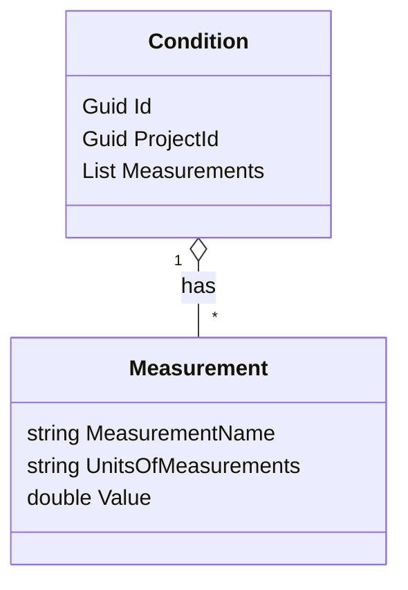
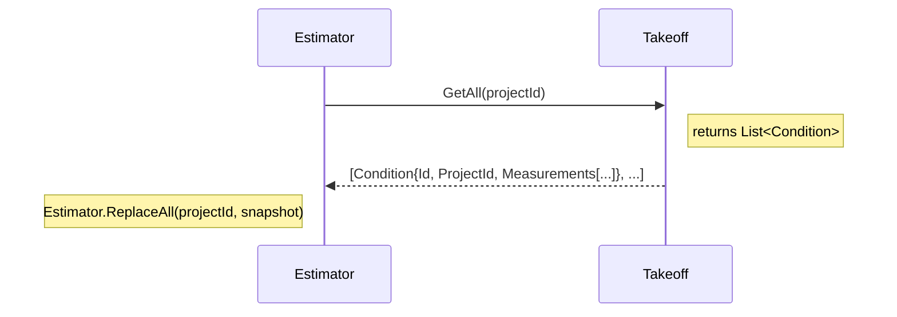
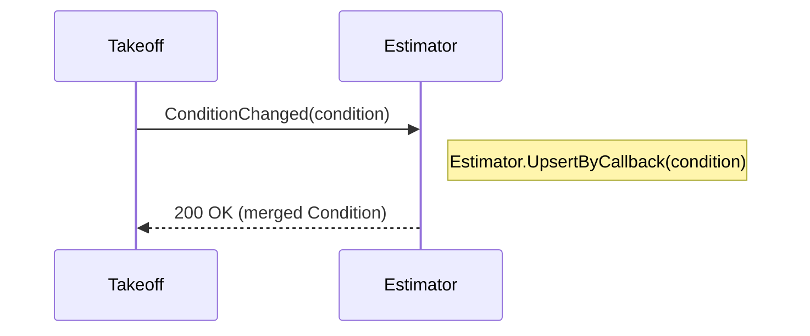
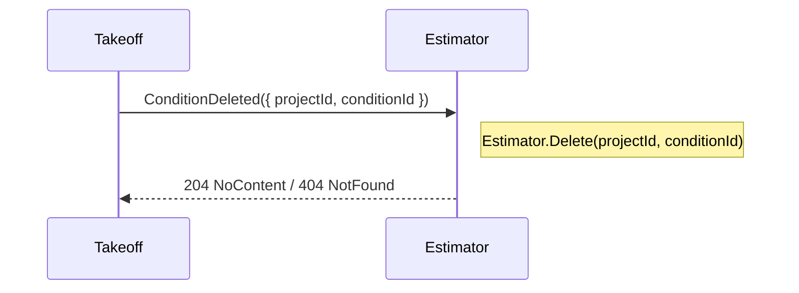

# Contracts Mermaid Diagrams

This file contains Mermaid diagrams visualizing the Contracts used in the solution (`Contracts` project) and simple interaction sequences that reference the contract shapes.

## Class diagram



## Sequence: Snapshot pull (Estimator requests full Condition list from Takeoff)



## Sequence: Change propagation (Takeoff ? Estimator)



## Sequence: Deletion propagation (Takeoff ? Estimator)



## JSON example (for reference)

```json
{
  "id": "00000000-0000-0000-0000-000000000000",
  "projectId": "11111111-1111-1111-1111-111111111111",
  "measurements": [
    {
      "measurementName": "Length",
      "unitsOfMeasurements": "m",
      "value": 12.5
    },
    {
      "measurementName": "Weight",
      "unitsOfMeasurements": "kg",
      "value": 3.2
    }
  ]
}
```


---

Place these diagrams into a Markdown file or render them in any Mermaid-capable viewer to visualize the Contracts and example interactions.