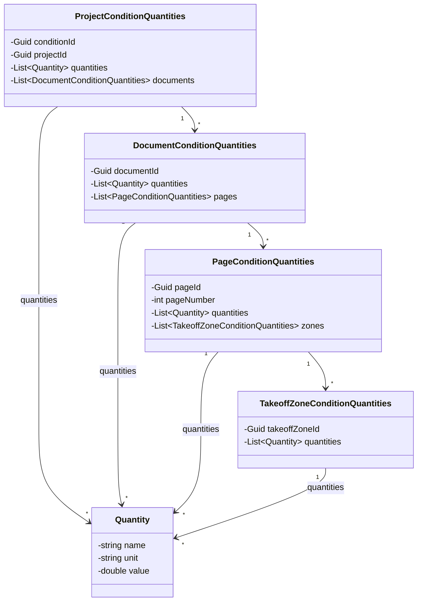
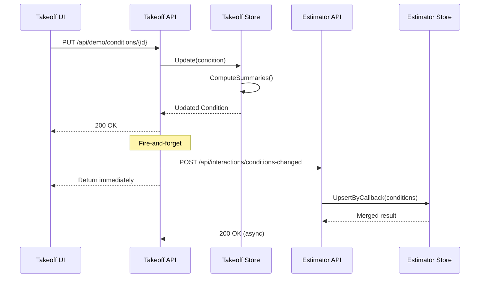
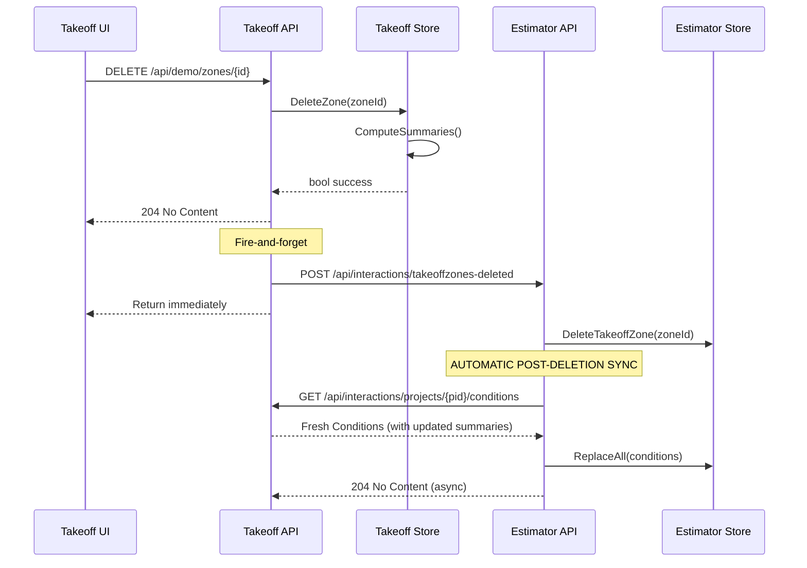
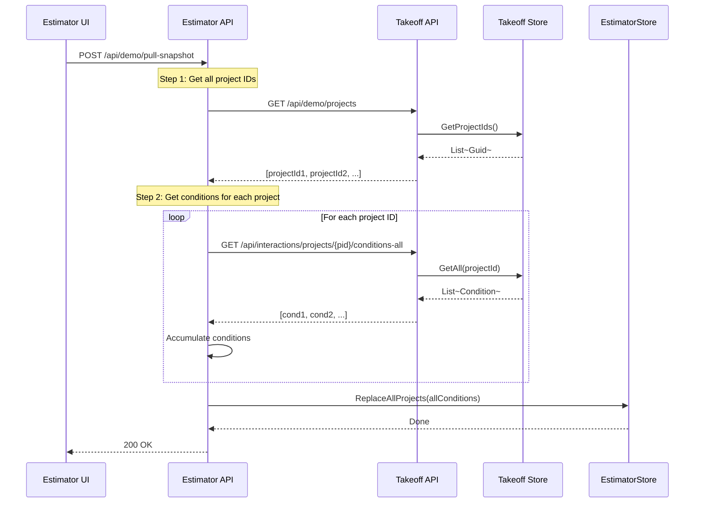
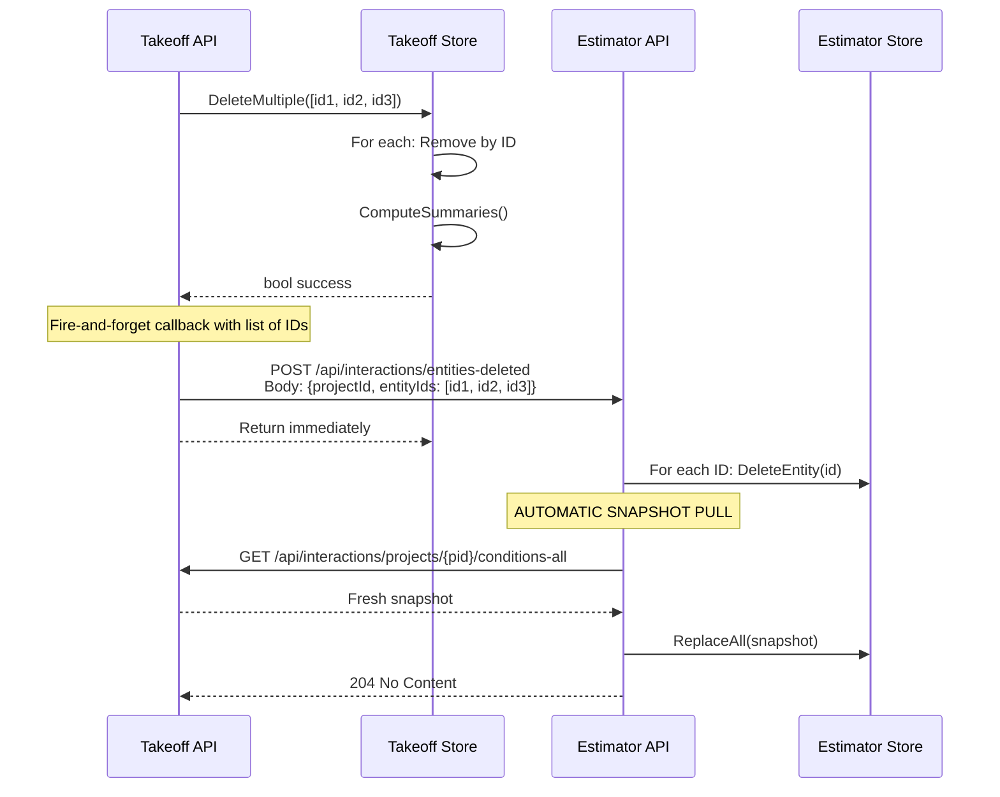
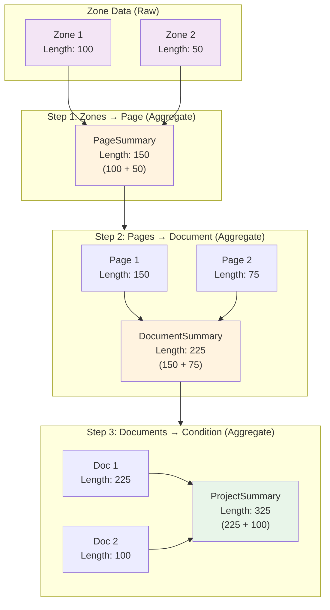
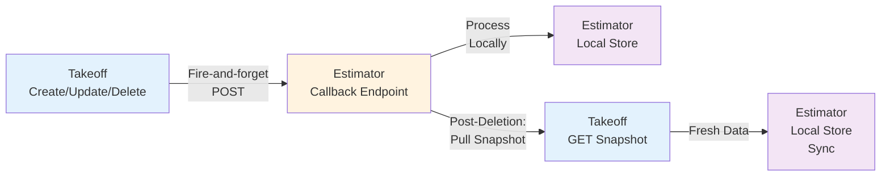

# Contract Data Model Diagrams

## 1. Class Diagram — Data Contracts and Relationships



---

## 2. Integration Message Flows

### 2.1 Condition Changed (Create/Update)



### 2.2 Deletion with Post-Deletion Snapshot Sync



### 2.3 Pull Snapshot Flow



---

## 3. Batch Deletion Flow



---

## 4. Summary Aggregation Logic (Takeoff Only)



---

## 5. Key Integration Patterns

### 5.1 Callback Pattern (Takeoff → Estimator)



### 5.2 Pull Pattern (Estimator → Takeoff)

```mermaid
graph LR
    A["Estimator<br/>On Demand"] -->|GET /api/demo/projects| B["Takeoff<br/>Project IDs"]
    B -->|List of IDs| C["Estimator<br/>For Each ID"]
    C -->|GET /api/interactions/projects/{id}/conditions| D["Takeoff<br/>Get Conditions"]
    D -->|Full Snapshot| E["Estimator<br/>Local Store"]
    
    style A fill:#e8f5e9
    style B fill:#e3f2fd
    style C fill:#fff3e0
    style D fill:#e3f2fd
    style E fill:#f3e5f5
```

---

## 6. Endpoint Route Summary

| Operation | From | To | Route | Method | Notes |
|-----------|------|----|----|--------|-------|
| **Change** | Takeoff | Estimator | `/api/interactions/conditions-changed` | POST | Full condition or diff |
| **Batch Delete** | Takeoff | Estimator | `/api/interactions/{entities}-deleted` | POST | List of IDs in payload |
| **Post-Delete Sync** | Estimator | Takeoff | `/api/interactions/projects/{id}/conditions-all` | GET | Automatic after deletion |
| **Pull Snapshot** | Estimator | Takeoff | `/api/demo/projects` | GET | Step 1: get IDs |
| **Pull Snapshot** | Estimator | Takeoff | `/api/interactions/projects/{id}/conditions-all` | GET | Step 2: get conditions |
