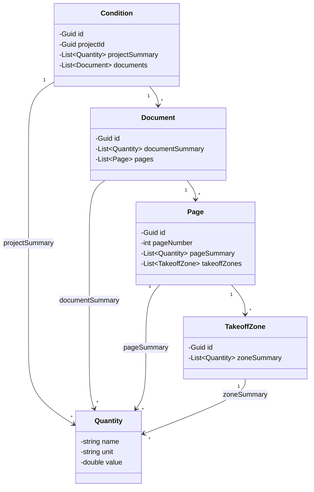
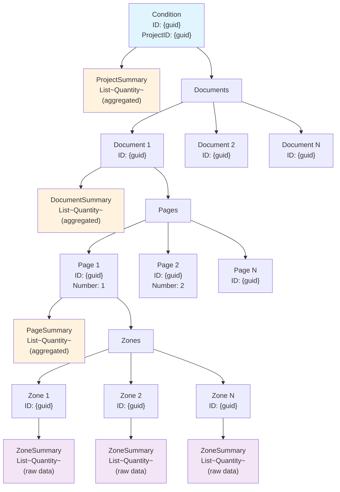
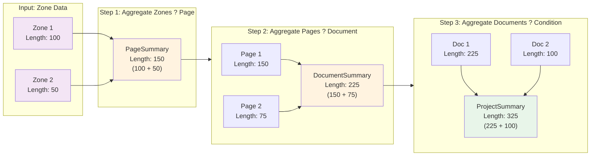
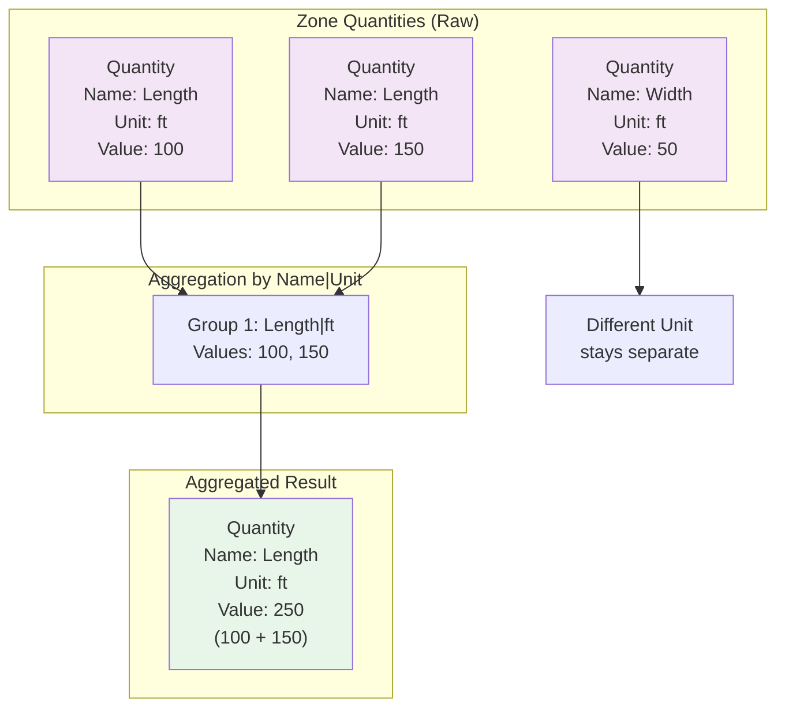
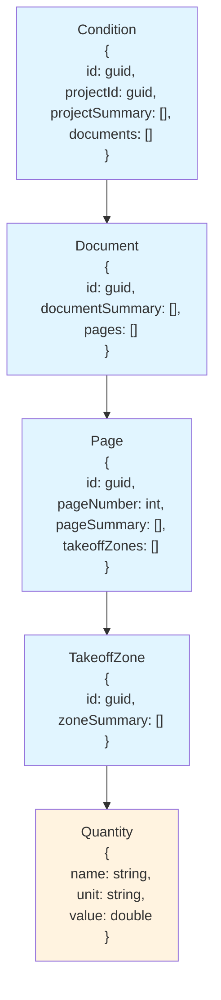
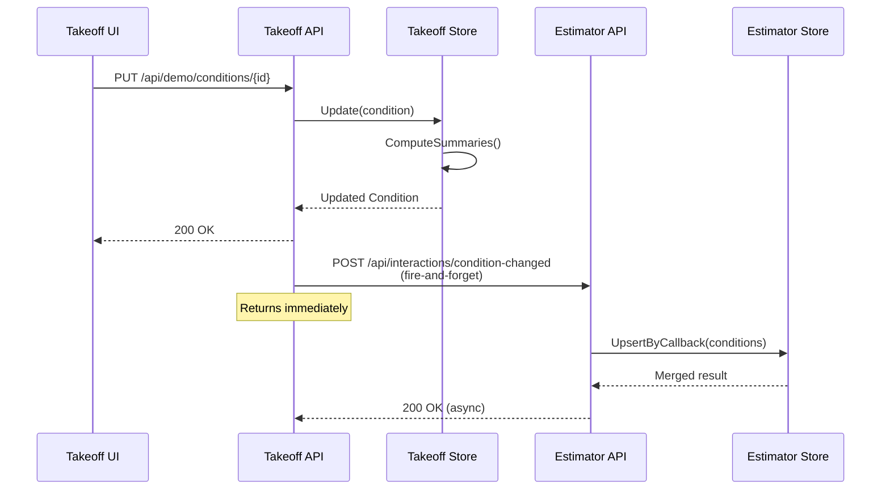
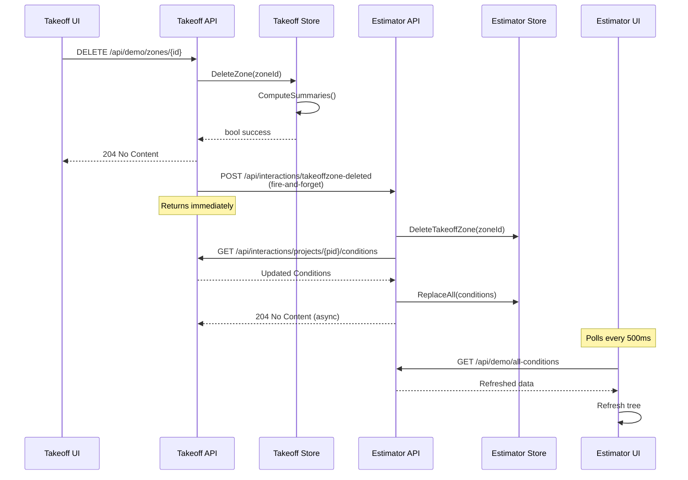
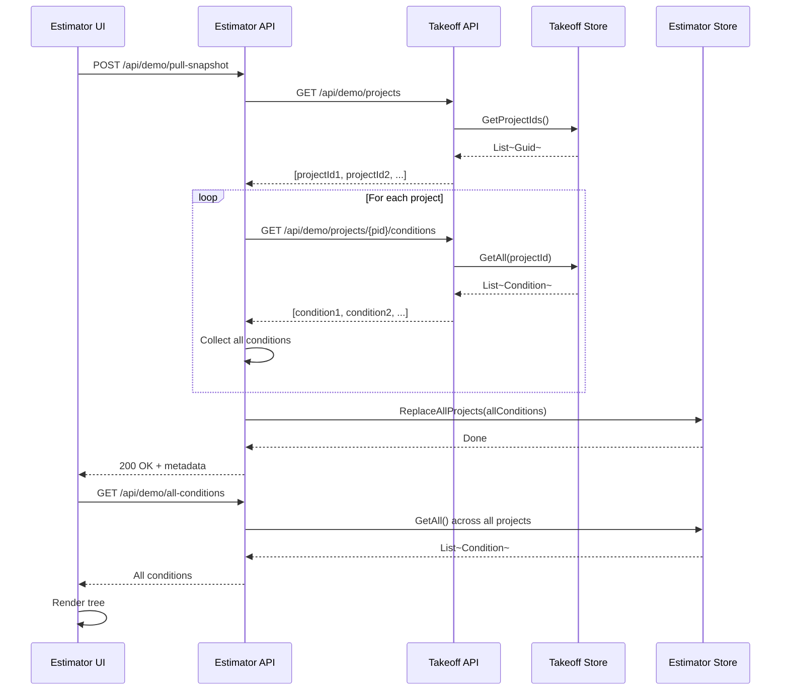
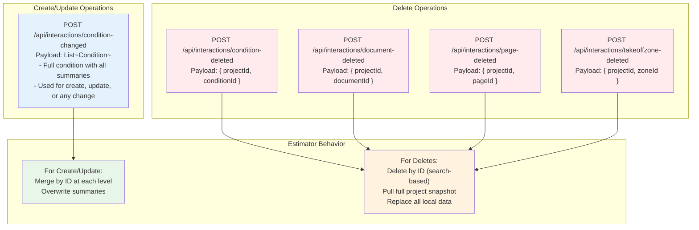

# Contract Data Model Diagrams

## 1. Class Diagram — Data Contracts and Relationships

---

## 2. Data Hierarchy — Tree Structure

---

## 3. Summary Aggregation Flow

---

## 4. Quantity Aggregation Logic

---

## 5. JSON Structure Example

---

## 6. Integration Message Flows

### Condition Changed (Create/Update)

### Deletion with Snapshot Sync

### Pull Snapshot Flow

---

## 7. Callback Type Summary

