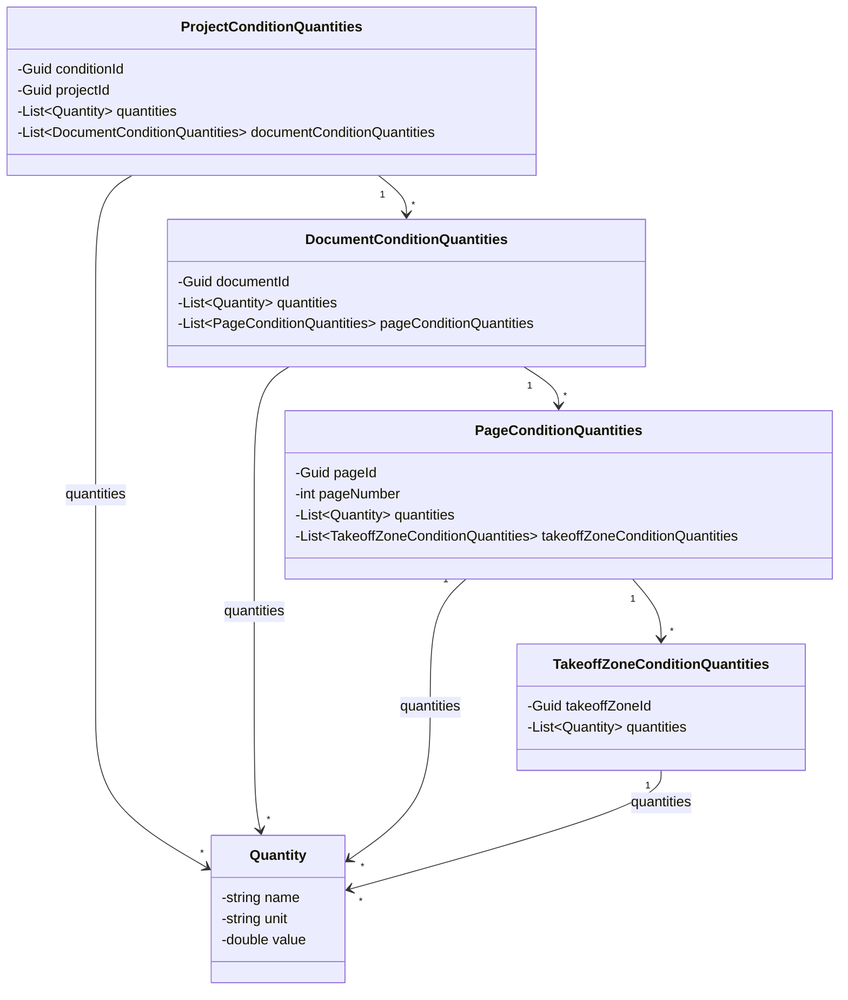
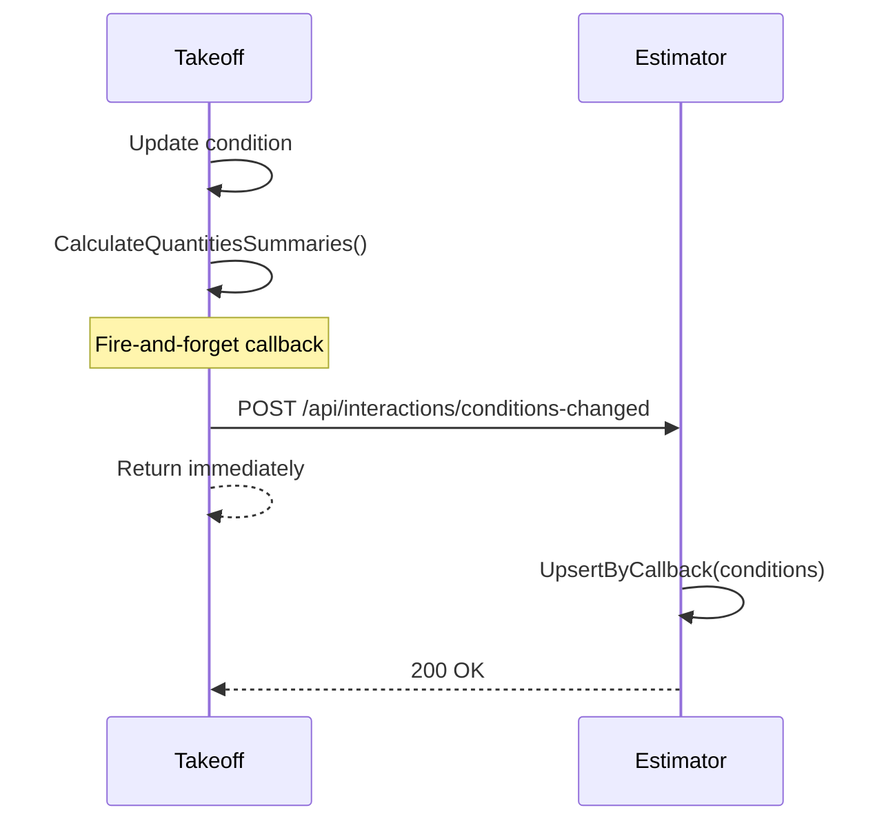
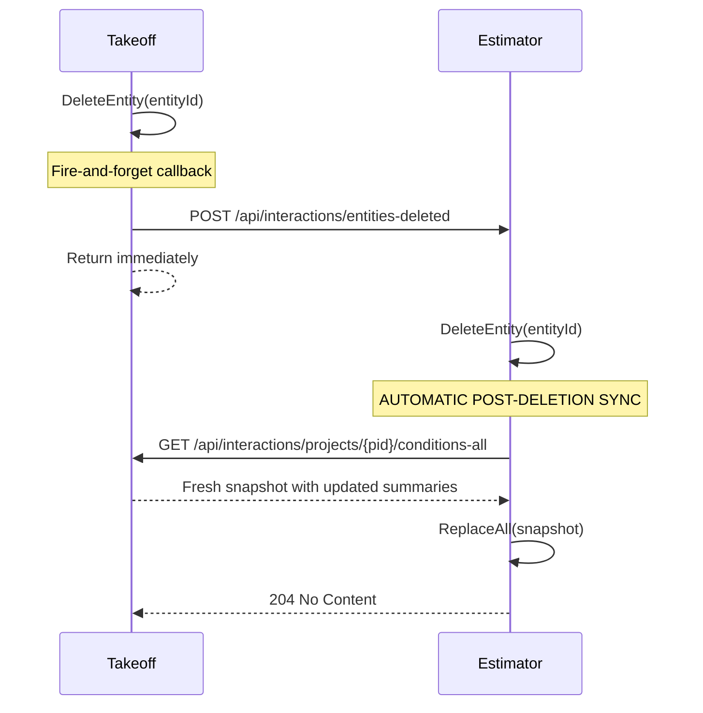
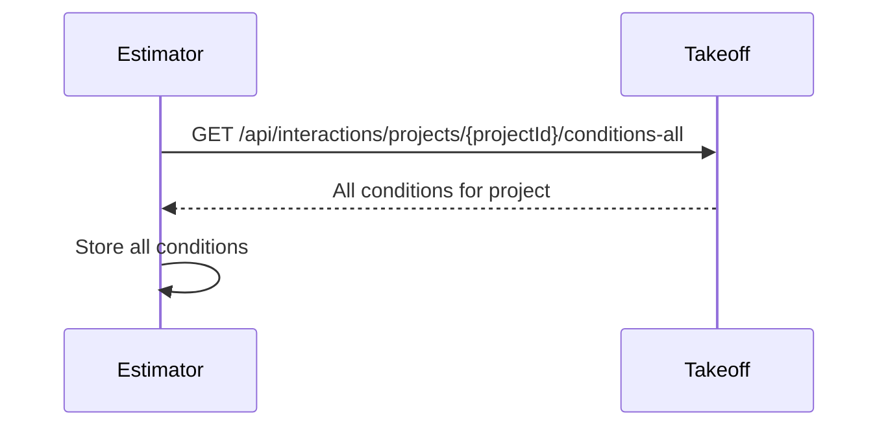
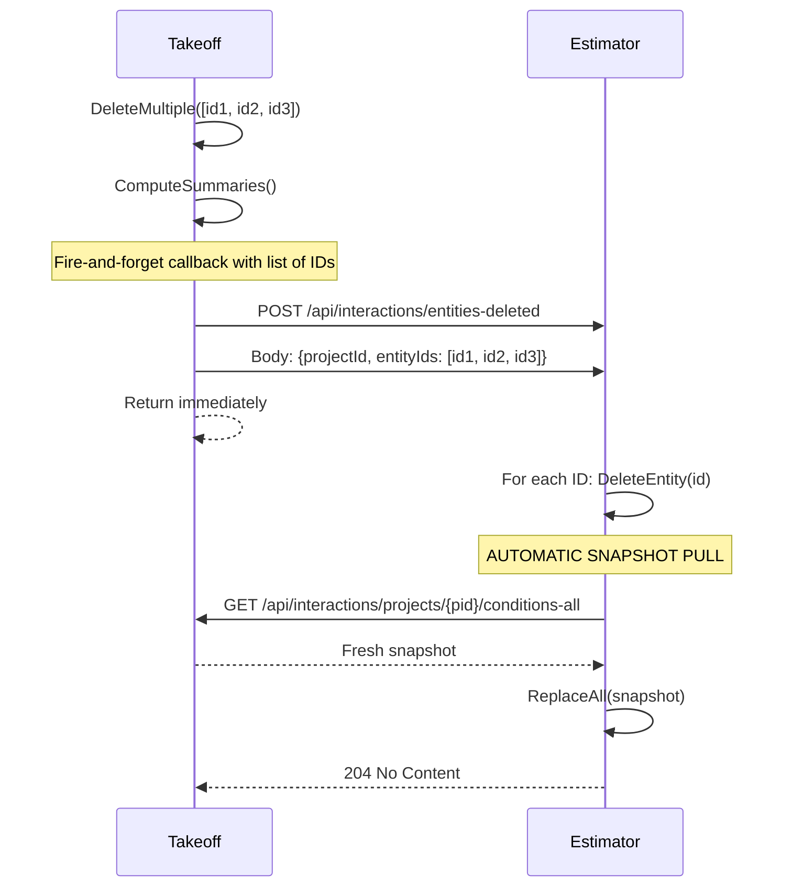
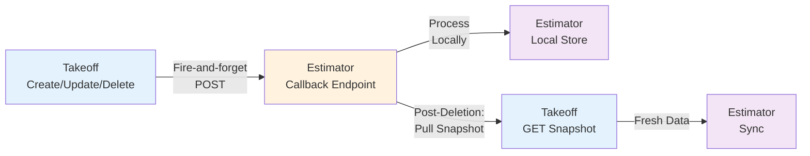
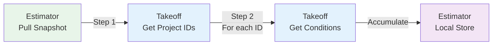

# Contract Data Model Diagrams

## 1. Class Diagram — Data Contracts and Relationships

---

## 2. Integration Message Flows

### 2.1 Conditions Changed (Create/Update)

### 2.2 Deletion with Post-Deletion Snapshot Sync

### 2.3 Pull Project Snapshot

---

## 3. Batch Deletion Flow

---

## 4. Integration Patterns

### 4.1 Callback Pattern (Takeoff → Estimator)

### 4.2 Pull Pattern (Estimator → Takeoff)

---

## 5. Endpoint Summary

| Operation | From | To | Route | Method |
|-----------|------|----|----|--------|
| Conditions Changed | Takeoff | Estimator | `/api/interactions/conditions-changed` | POST |
| Batch Delete Entities | Takeoff | Estimator | `/api/interactions/{entity}-deleted` | POST |
| Get Conditions for Project | Estimator | Takeoff | `/api/interactions/projects/{id}/conditions-all` | GET |
