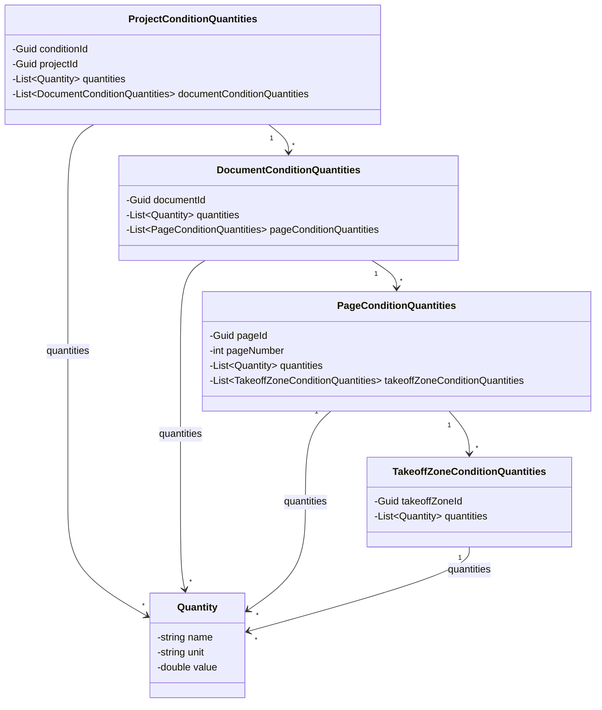
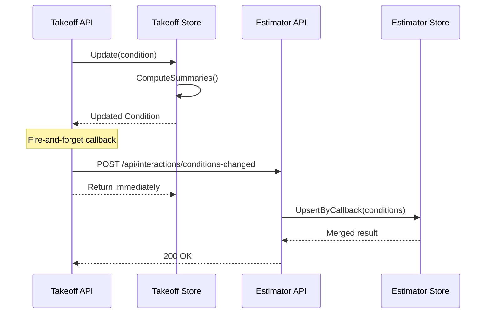
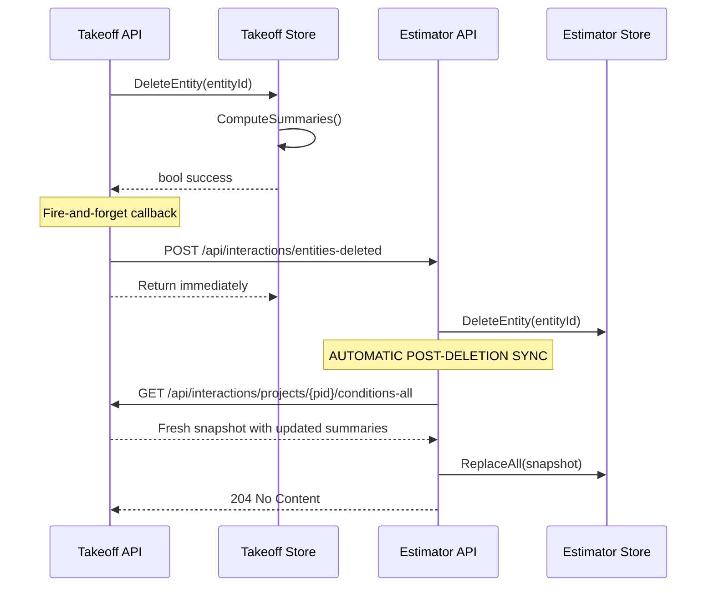
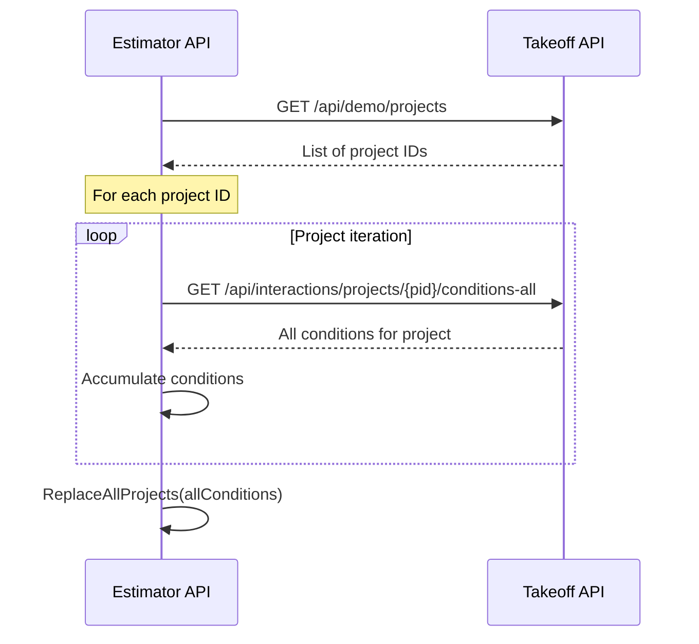
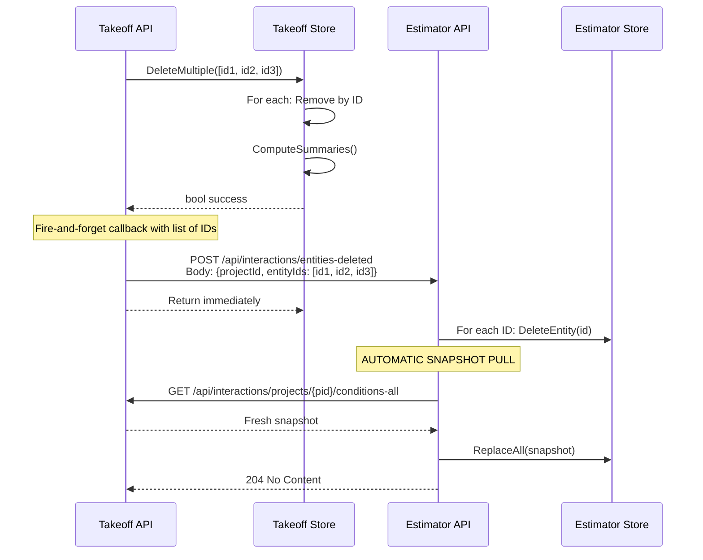
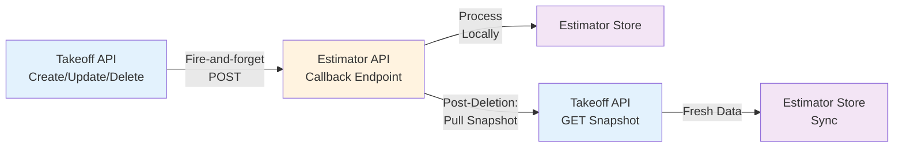

# Contract Data Model Diagrams

## 1. Class Diagram — Data Contracts and Relationships



---

## 2. Integration Message Flows

### 2.1 Conditions Changed (Create/Update)



### 2.2 Deletion with Post-Deletion Snapshot Sync



### 2.3 Pull Snapshot Flow



---

## 3. Batch Deletion Flow



---

## 4. Integration Patterns

### 4.1 Callback Pattern (Takeoff → Estimator)



### 4.2 Pull Pattern (Estimator → Takeoff)

```mermaid
graph LR
    A["Estimator API<br/>On Demand"] -->|GET /api/demo/projects| B["Takeoff API<br/>Project IDs"]
    B -->|List of IDs| C["Estimator API<br/>For Each ID"]
    C -->|GET /api/interactions/projects/{id}/conditions-all| D["Takeoff API<br/>Get Conditions"]
    D -->|Full Conditions| E["Estimator Store"]
    
    style A fill:#e8f5e9
    style B fill:#e3f2fd
    style C fill:#fff3e0
    style D fill:#e3f2fd
    style E fill:#f3e5f5
```

---

## 5. Endpoint Summary

| Operation | From | To | Route | Method |
|-----------|------|----|----|--------|
| Conditions Changed | Takeoff | Estimator | `/api/interactions/conditions-changed` | POST |
| Batch Delete Entities | Takeoff | Estimator | `/api/interactions/{entity}-deleted` | POST |
| Get Conditions for Project | Estimator | Takeoff | `/api/interactions/projects/{id}/conditions-all` | GET |
