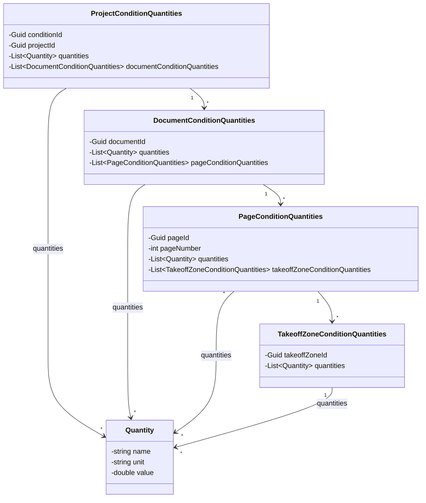
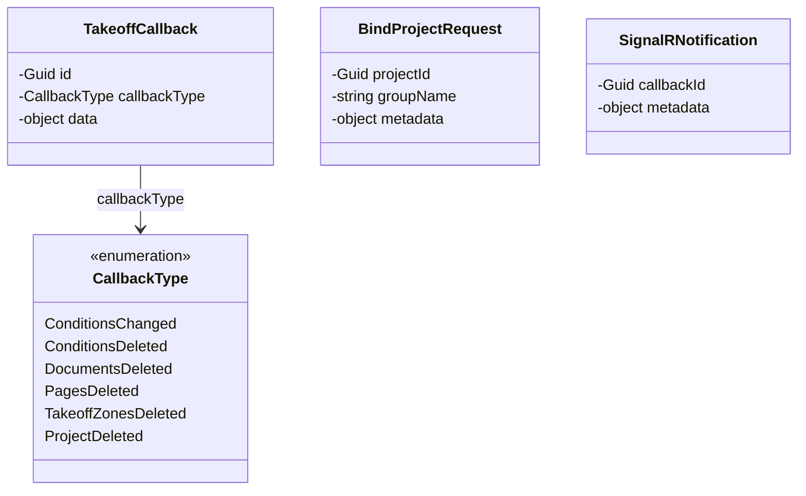
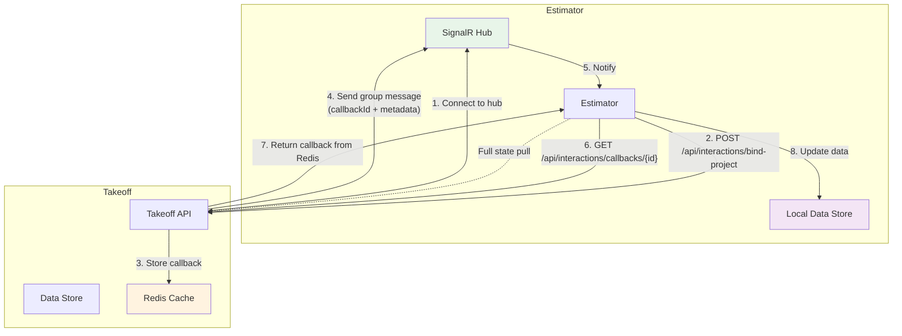
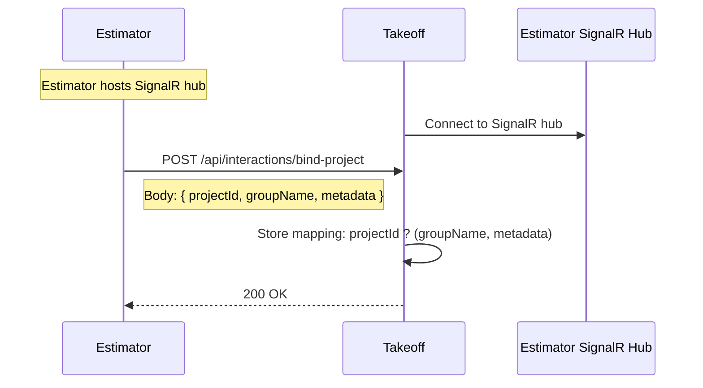
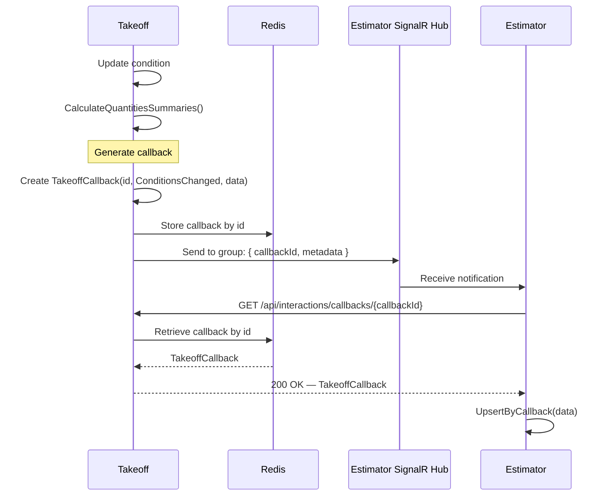
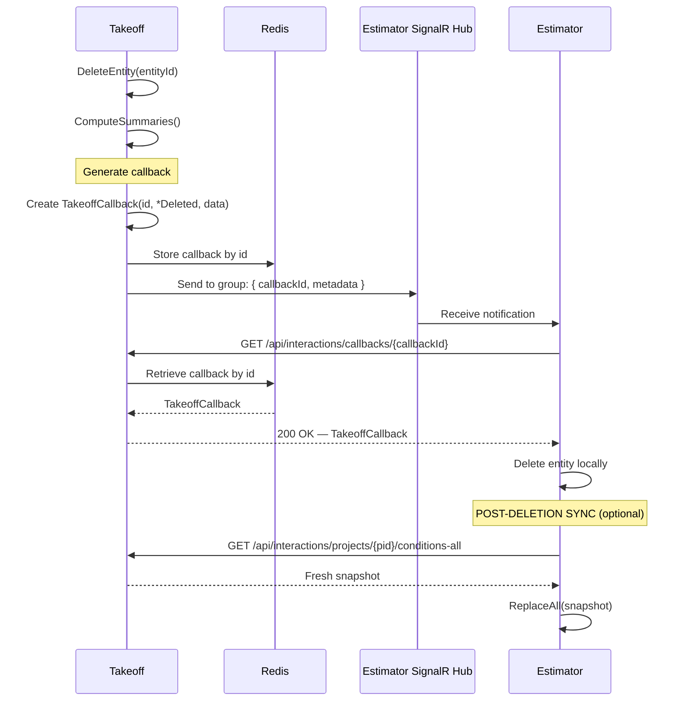
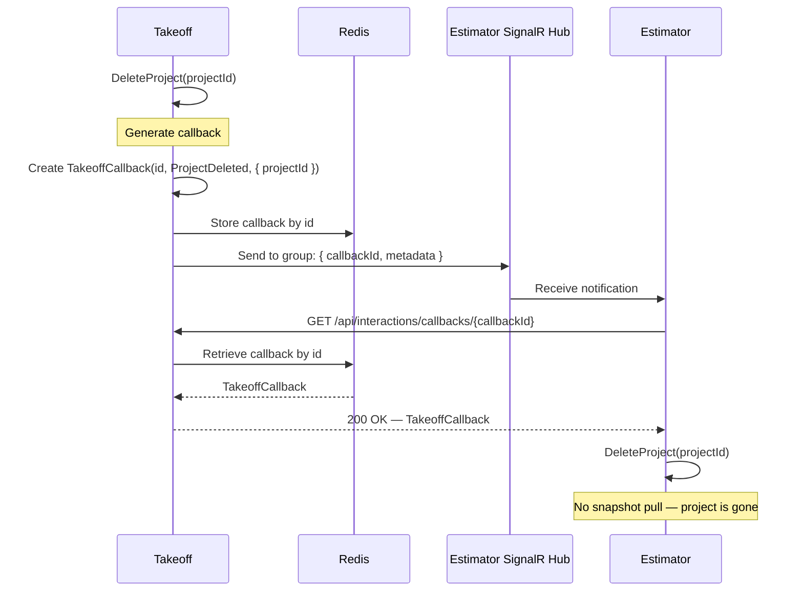
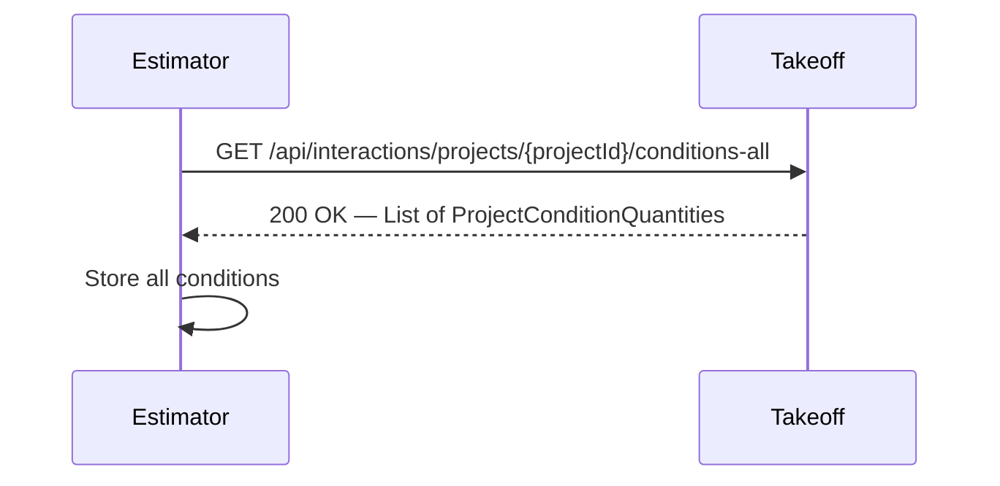
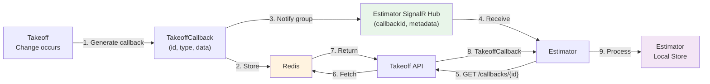

# Takeoff–Estimator Integration Specification

## 1. Overview

This document specifies the integration contracts and interaction protocols between the **Takeoff** service and the **Estimator** service. Takeoff is the authoritative source for condition data and quantity summaries. Estimator is a consumer that receives change notifications in real time and maintains a local copy of the data.

Communication between the services uses a combination of **SignalR** for real-time notifications and **HTTP** for data retrieval. Change payloads are stored temporarily in **Redis** on the Takeoff side, and Estimator fetches them on demand.

### Key Principles

- **Takeoff** is the single source of truth for all condition data and computed summaries.
- **Estimator** does not compute summaries. It receives and stores them exactly as provided by Takeoff.
- **Estimator** hosts a SignalR hub. Takeoff connects to it and sends group messages to notify Estimator of changes.
- Change payloads (**callbacks**) are stored in **Redis** on the Takeoff side, keyed by a unique ID (GUID).
- SignalR messages are lightweight — they carry only the callback ID and binding metadata, not the full payload.
- Estimator fetches the full callback from Takeoff over HTTP using the callback ID.
- Estimator can pull a full project snapshot from Takeoff at any time via HTTP.

---

## 2. Shared Contracts

All data exchanged between the services uses the following contract types, defined in the `Contracts` namespace.

### 2.1 Quantity

| Property | Type     | Description                          |
|----------|----------|--------------------------------------|
| `name`   | `string` | Name of the measured quantity        |
| `unit`   | `string` | Unit of measurement                  |
| `value`  | `double` | Numeric value                        |

### 2.2 ProjectConditionQuantities

| Property                      | Type                                    | Description                                |
|-------------------------------|-----------------------------------------|--------------------------------------------|
| `conditionId`                 | `Guid`                                  | Unique condition identifier                |
| `projectId`                   | `Guid`                                  | Project this condition belongs to          |
| `quantities`                  | `List<Quantity>`                        | Aggregated from documents (computed by Takeoff) |
| `documentConditionQuantities` | `List<DocumentConditionQuantities>`     | Documents within the condition             |

### 2.3 DocumentConditionQuantities

| Property                      | Type                                | Description                         |
|-------------------------------|-------------------------------------|-------------------------------------|
| `documentId`                  | `Guid`                              | Unique document identifier          |
| `quantities`                  | `List<Quantity>`                    | Aggregated from pages (computed by Takeoff) |
| `pageConditionQuantities`     | `List<PageConditionQuantities>`     | Pages within the document           |

### 2.4 PageConditionQuantities

| Property                         | Type                                        | Description                       |
|----------------------------------|--------------------------------------------|-----------------------------------|
| `pageId`                         | `Guid`                                      | Unique page identifier            |
| `pageNumber`                     | `int`                                       | Page number within the document   |
| `quantities`                     | `List<Quantity>`                            | Aggregated from zones (computed by Takeoff) |
| `takeoffZoneConditionQuantities` | `List<TakeoffZoneConditionQuantities>`      | Zones on this page                |

### 2.5 TakeoffZoneConditionQuantities

| Property         | Type             | Description                    |
|------------------|------------------|--------------------------------|
| `takeoffZoneId`  | `Guid`           | Unique zone identifier         |
| `quantities`     | `List<Quantity>` | Raw quantities for this zone   |

### 2.6 Data Hierarchy

```text
ProjectConditionQuantities
+-- Quantities (computed by Takeoff)
+-- DocumentConditionQuantities[]
    +-- Quantities (computed by Takeoff)
    +-- PageConditionQuantities[]
        +-- Quantities (computed by Takeoff)
        +-- TakeoffZoneConditionQuantities[]
            +-- Quantities (raw data)
```

### 2.7 CallbackType (Enum)

Identifies the kind of change that occurred on the Takeoff side.

| Value | Description |
|-------|-------------|
| `ConditionsChanged` | Conditions were created or updated |
| `ConditionsDeleted` | Conditions were deleted |
| `DocumentsDeleted` | Documents were deleted |
| `PagesDeleted` | Pages were deleted |
| `TakeoffZonesDeleted` | Takeoff zones were deleted |
| `ProjectDeleted` | An entire project was deleted |

### 2.8 TakeoffCallback

The change payload that Takeoff generates and stores in Redis.

| Property | Type | Description |
|----------|------|-------------|
| `id` | `Guid` | Unique callback identifier |
| `callbackType` | `CallbackType` | The type of change that occurred |
| `data` | `object` | The change payload (format depends on `callbackType` — see §2.10) |

### 2.9 BindProjectRequest

Request body for linking a Takeoff project to a SignalR group.

| Property | Type | Description |
|----------|------|-------------|
| `projectId` | `Guid` | The project to bind |
| `groupName` | `string` | The SignalR group name to associate with the project |
| `metadata` | `object` | Arbitrary metadata passed during binding; echoed back in SignalR notifications |

### 2.10 Callback Data Formats by Type

The `data` field of `TakeoffCallback` carries the change payload. Its format depends on the `callbackType`:

| CallbackType | `data` Format |
|--------------|---------------|
| `ConditionsChanged` | `List<ProjectConditionQuantities>` |
| `ConditionsDeleted` | `{ projectId: Guid, conditionIds: List<Guid> }` |
| `DocumentsDeleted` | `{ projectId: Guid, documentIds: List<Guid> }` |
| `PagesDeleted` | `{ projectId: Guid, pageIds: List<Guid> }` |
| `TakeoffZonesDeleted` | `{ projectId: Guid, zoneIds: List<Guid> }` |
| `ProjectDeleted` | `{ projectId: Guid }` |

### 2.11 SignalRNotification

The message sent to the SignalR group when a callback is ready.

| Property | Type | Description |
|----------|------|-------------|
| `callbackId` | `Guid` | The unique ID of the callback stored in Redis |
| `metadata` | `object` | The same metadata object that was supplied in the `BindProjectRequest` |

---

## 3. Contract Diagrams

### 3.1 Data Contracts — Class Diagram



### 3.2 Integration Contracts — Class Diagram



---

## 4. Architecture Overview



---

## 5. Interaction Scenario (Step by Step)

### 5.1 Binding Phase

Before any change notifications can flow, the Estimator must bind a project to a SignalR group on the Takeoff side.

1. **Estimator** hosts a SignalR hub. The hub URL is configured and known to Takeoff (e.g., via service configuration or discovery).
2. **Takeoff** establishes a SignalR connection to the Estimator hub.
3. **Estimator** calls Takeoff's `POST /api/interactions/bind-project` endpoint, passing the `projectId`, a `groupName`, and a `metadata` object.
4. **Takeoff** stores the mapping: `projectId ? (groupName, metadata)`.

### 5.2 Change Notification Flow

When a change occurs on the Takeoff side (condition created/updated, entity deleted, etc.):

1. **Takeoff** generates a `TakeoffCallback` object with a unique `id` (GUID), the appropriate `callbackType`, and the `data` payload.
2. **Takeoff** stores the `TakeoffCallback` in **Redis**, keyed by its `id`.
3. **Takeoff** looks up the SignalR group name bound to the affected project.
4. **Takeoff** sends a `SignalRNotification` message to that SignalR group, containing the `callbackId` and the `metadata` from the original binding.
5. **Estimator** receives the SignalR message.
6. **Estimator** calls Takeoff's `GET /api/interactions/callbacks/{callbackId}` endpoint to retrieve the full `TakeoffCallback`.
7. **Estimator** processes the callback based on its `callbackType` and `data`, updating its local store accordingly.
8. If the callback is a deletion (and not a project deletion), Estimator may additionally pull a fresh project snapshot via `GET /api/interactions/projects/{projectId}/conditions-all` for consistency.

### 5.3 Full State Pull

At any time, Estimator can pull the complete state for a project using:

- `GET /api/interactions/projects/{projectId}/conditions-all` ? returns `List<ProjectConditionQuantities>`

This is used when Estimator needs the entire current state rather than an incremental change.

---

## 6. Sequence Diagrams

### 6.1 Binding a Project to a SignalR Group



### 6.2 Conditions Changed (Create/Update)



### 6.3 Entity Deletion (Conditions / Documents / Pages / Zones)



### 6.4 Project Deletion



### 6.5 Full State Pull



---

## 7. Endpoint Specification

### 7.1 Bind Project to SignalR Group (Takeoff)

- **Method**: POST
- **Path**: `/api/interactions/bind-project`
- **Request Body**: `BindProjectRequest`

| Property | Type | Required | Description |
|----------|------|----------|-------------|
| `projectId` | `Guid` | Yes | The project to bind |
| `groupName` | `string` | Yes | SignalR group name |
| `metadata` | `object` | No | Arbitrary metadata; echoed in notifications |

- **Response**: `200 OK`

**Behavior**:
- Takeoff stores the mapping between the project ID and the SignalR group name along with the metadata.
- If a binding already exists for the project, it is overwritten.

---

### 7.2 Get Callback by ID (Takeoff)

- **Method**: GET
- **Path**: `/api/interactions/callbacks/{callbackId}`
- **Response**: `200 OK` with `TakeoffCallback`

| Response Property | Type | Description |
|-------------------|------|-------------|
| `id` | `Guid` | Callback ID |
| `callbackType` | `string` | One of: `ConditionsChanged`, `ConditionsDeleted`, `DocumentsDeleted`, `PagesDeleted`, `TakeoffZonesDeleted`, `ProjectDeleted` |
| `data` | `object` | The change payload (see §2.10) |

- **Error Responses**:
  - `404 Not Found` — callback ID does not exist in Redis (may have expired or never existed)

**Behavior**:
- Takeoff retrieves the callback from Redis by the given ID and returns it.

---

### 7.3 Get Conditions for a Project (Takeoff)

- **Method**: GET
- **Path**: `/api/interactions/projects/{projectId}/conditions-all`
- **Response**: `200 OK` with `List<ProjectConditionQuantities>`

Returns all conditions for the given project, with summaries already computed by Takeoff.

---

## 8. SignalR Hub Specification

### 8.1 Hub Location

- **Hosted by**: Estimator
- **Hub path**: Configurable (e.g., `/hubs/integration`)
- **Connection**: Takeoff establishes a persistent connection to the Estimator SignalR hub at startup or on demand.

### 8.2 Group Management

- When Estimator starts or needs to receive notifications for a project, it calls `POST /api/interactions/bind-project` on Takeoff, providing the `groupName`.
- Takeoff's SignalR client joins the corresponding group on the Estimator hub.
- Messages for a project are sent to all connections in the associated group.

### 8.3 Client Method

The SignalR hub defines the following client-invocable method:

| Method Name | Parameters | Description |
|-------------|------------|-------------|
| `OnCallback` | `callbackId: Guid`, `metadata: object` | Invoked on Estimator when a callback is ready for retrieval |

---

## 9. Redis Usage

### 9.1 Purpose

Redis is used by Takeoff as a temporary store for callback payloads. This decouples the notification (lightweight SignalR message) from the payload retrieval (HTTP GET).

### 9.2 Key Schema

| Key Pattern | Value | TTL |
|-------------|-------|-----|
| `callback:{callbackId}` | Serialized `TakeoffCallback` JSON | Configurable (recommended: minutes to hours) |

### 9.3 Lifecycle

1. Takeoff writes the callback to Redis immediately after generating it.
2. Takeoff sends the SignalR notification with the callback ID.
3. Estimator retrieves the callback via the HTTP endpoint.
4. The callback expires from Redis after the configured TTL.

---

## 10. End-to-End Flow Diagram



---

## 11. Endpoint Summary

| Operation | From | To | Route | Method |
|-----------|------|----|-------|--------|
| Bind project to SignalR group | Estimator | Takeoff | `/api/interactions/bind-project` | POST |
| Get callback by ID | Estimator | Takeoff | `/api/interactions/callbacks/{callbackId}` | GET |
| Get conditions for project | Estimator | Takeoff | `/api/interactions/projects/{projectId}/conditions-all` | GET |

---

## 12. Communication Protocol

- **Real-time notifications**: SignalR (WebSockets with automatic fallback)
- **Data retrieval**: HTTP/HTTPS
- **Callback storage**: Redis
- **Serialization**: JSON with camelCase property naming
- **Error Handling**:
  - SignalR notifications are best-effort; if Estimator is disconnected, it should pull full state on reconnect.
  - Callback retrieval failures should be retried with exponential backoff.
  - Redis TTL ensures stale callbacks are automatically cleaned up.
  - All errors logged with structured logging.
